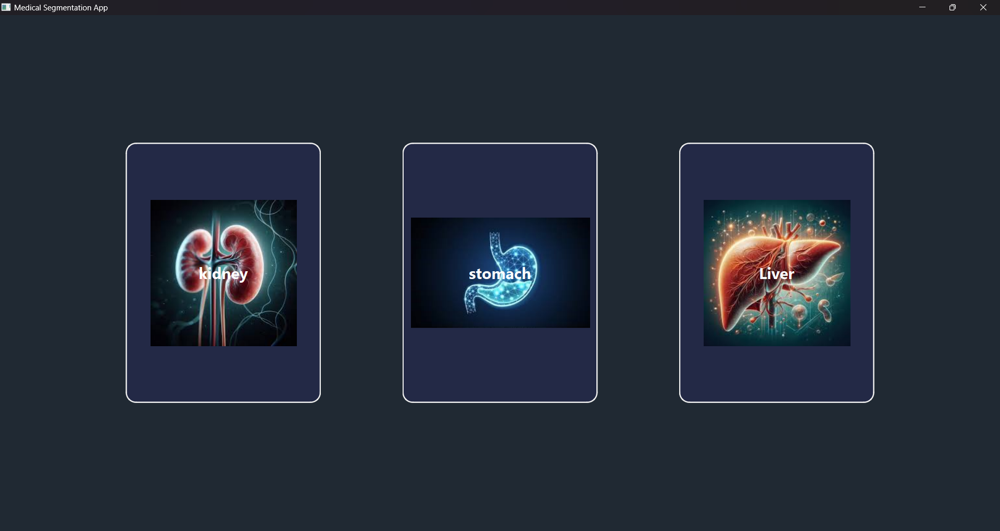
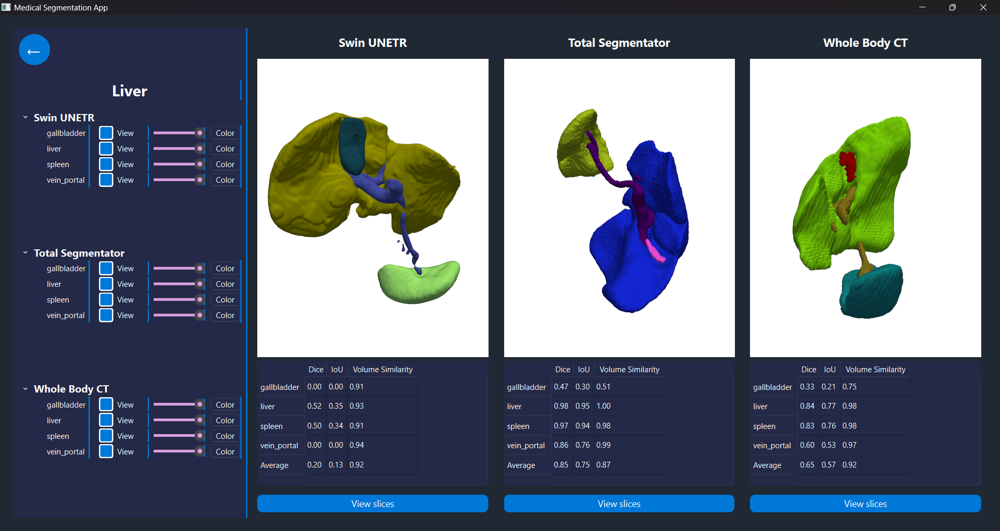
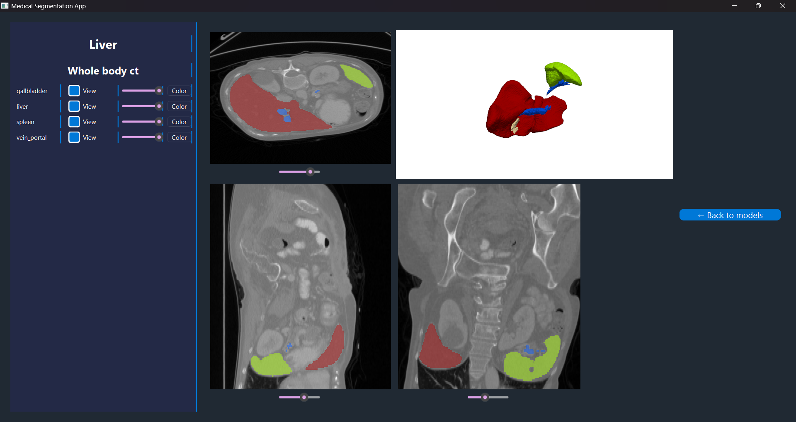

# Medical Image Segmentation

<p align="center">
  
</p>

# Medical Image Segmentation
## Overview

**Medical Image Segmentation** is a Python-based project designed to segment medical images accurately and efficiently, and allows for comprehensive evaluation of the used models. This repository is a project submitted to the Biomedical Engineering Department at Cairo University.

---

## Features

- Multimodel integration.
- Robust visualization tools (3D & 2D)
- Easy-to-use interface for interaction.
- Comprehensive Evaluation Suite
- Modular and scalable codebase for experimentation.
- Compatibility with multiple medical imaging formats.

---

## Table of Contents

- [Overview](#overview)
- [Features](#features)
- [Installation](#installation)
- [Usage](#usage)
- [Examples](#examples)
- [Screenshots and Visuals](#screenshots-and-visuals)
- [Contributing](#contributing)
- [License](#license)

---

## Installation

To get started with Medical Image Segmentation, follow these steps:

1. Clone the repository:
   ```bash
   git clone --recursive https://github.com/Ziad-Ashraf-Mostafa/Medical-Image-Segmentation.git
   ```

2. Create and activate a virtual environment:
   ```bash
   python -m venv venv
   source venv/bin/activate   # On Windows: venv\Scripts\activate
   ```

3. Install the required dependencies from the notebook (mis.ipynb)

Make sure you have Python 3.8+ installed before proceeding with the installation.

---

## Usage

Here’s how you can run and use the project:

1. Prepare your dataset:
   - Place your medical images in the `data/` directory (or configure the `dataset_path` in the script).

2. Run the segmentation code block in the notebook. 

4. Evaluate the results:
   Use the evaluation code block in the notebook.

---
## Evaluation Results
| Model | Dice | IoU | Volume Similarity |
| :------ | :------ | :---------- | :------ |
| Swin UNETR | 0.557 | 0.386 | 0.92 |
| Total Segmentator | 0.949 | 0.904 | 0.87 | 
| WholeBody CT | 0.831 | 0.759 | 0.91 |
---
## Examples

Here are some examples of how to use the project:

- **Single Image Segmentation:**
  ```py
   %matplotlib inline
   import sys
   sys.path.append('/content/drive/MyDrive/SBME Tasks/Year 1/Task 0')
   import mspipeline
   
   # Example configuration
   config = {
       'output_base_dir': '/path/to/output',
       'swin_model_path': '/path/to/model/model.pt',
       'wbct_model_path': '/path/to/model/model.pt',
       'wbct_config_path': '/path/to/configuration/inference.json',
       'use_swin': True,
       'use_totalsegmentator': True,
       'use_wholebody_ct': True,
       'debug_mode': True,
       'enable_profiling': True,
       'processing': {
           'roi_size': (128, 128, 128),
           'sw_batch_size': 2,
           'overlap': 0.5,
           'enable_memory_mapping': True
       }
   }
   
   # Initialize pipeline
   pipeline = mspipeline.EnhancedMedicalSegmentationPipeline(config)
   
   try:
       # Process single patient
       result = pipeline.process_patient('/content/drive/MyDrive/SBME Tasks/Year 1/Task 0/data/raw/img0001.nii.gz', 'patient_001')   
   except Exception as e:
       print(f"Pipeline failed: {e}")
       mspipeline.traceback.print_exc()
   
   finally:
       pipeline.cleanup()
  ```

- **Batch Processing:**
  ```py
  
   %matplotlib inline
   import sys
   sys.path.append('/content/drive/MyDrive/SBME Tasks/Year 1/Task 0')
   import mspipeline
   
   # Example configuration
   config = {
       'output_base_dir': '/path/to/output',
       'swin_model_path': '/path/to/model/model.pt',
       'wbct_model_path': '/path/to/model/model.pt',
       'wbct_config_path': '/path/to/configuration/inference.json',
       'use_swin': True,
       'use_totalsegmentator': True,
       'use_wholebody_ct': True,
       'debug_mode': True,
       'enable_profiling': True,
       'processing': {
           'roi_size': (128, 128, 128),
           'sw_batch_size': 2,
           'overlap': 0.5,
           'enable_memory_mapping': True
       }
   }
   
   # Initialize pipeline
   pipeline = mspipeline.EnhancedMedicalSegmentationPipeline(config)
   
   try:
    # Process batch
    # image_paths = ['./data/patient_001.nii.gz', './data/patient_002.nii.gz']
    batch_results = pipeline.process_batch(image_paths)

   except Exception as e:
       print(f"Pipeline failed: {e}")
       mspipeline.traceback.print_exc()
   
   finally:
       pipeline.cleanup()
  ```

---

## Screenshots and Visuals

### Segmented Output
 <!-- Placeholder for input image -->
 <!-- Placeholder for segmented output -->
 <!-- Placeholder for segmented output -->

### Workflow GIF
 <!-- Placeholder for GIF -->

---

## Contributing

We welcome contributions to improve this project! To contribute, follow these steps:

1. Fork the repository.
2. Create a new branch:
   ```bash
   git checkout -b feature-name
   ```
3. Commit your changes:
   ```bash
   git commit -m "Add new feature"
   ```
4. Push to the branch:
   ```bash
   git push origin feature-name
   ```
5. Open a Pull Request.

---

## License

This project is licensed under the MIT License. See the [LICENSE](LICENSE) file for details.

---

## Contact

For queries or suggestions:
- Open an issue on the [GitHub repository](https://github.com/Ziad-Ashraf-Mostafa/Medical-Image-Segmentation/issues).
- Email (Contact any member of the team): ziad.abd-elawad06@eng-st.cu.edu.eg, ahmedmamdouhenan18@gmail.com, yahya.ismail06@eng-st.cu.edg.eg, hakeem.taha06@eng-st.cu.edu.eg
